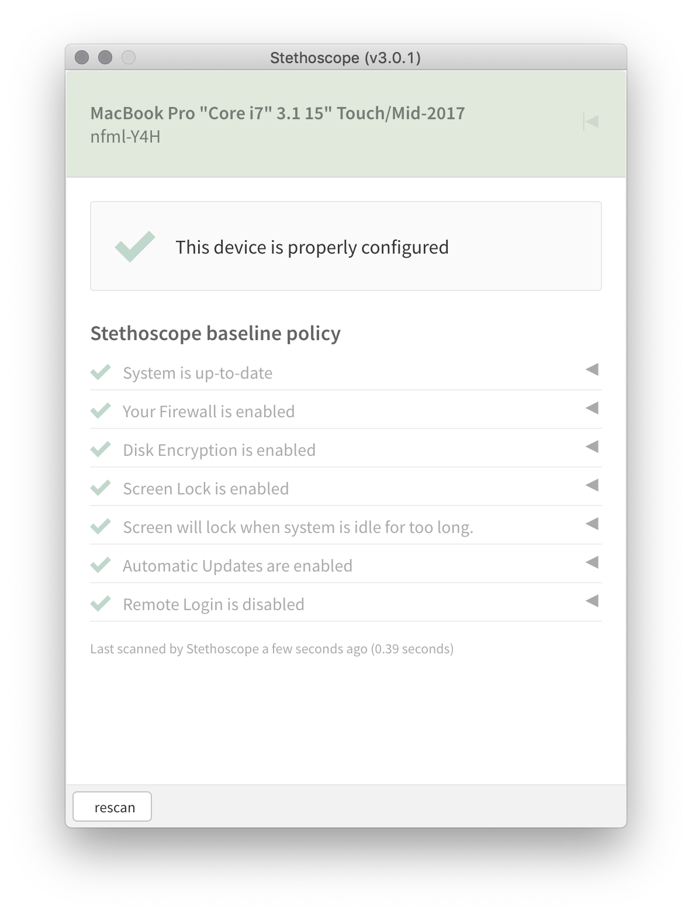

# Stethoscope app

[](https://gitter.im/Netflix-Stethoscope/Lobby?utm_source=badge&utm_medium=badge&utm_campaign=pr-badge&utm_content=badge) [](http://www.apache.org/licenses/LICENSE-2.0) []()

The Stethoscope app is a desktop application created by Netflix that checks security-related settings and makes recommendations for improving the configuration of your computer, without requiring central device management or automated reporting.

<center>

</center>

Opening the app will run a quick check of your device configuration and present recommendations and instructions.

It does not automatically report device status to a central server, but can be configured to allow requests from particular web pages. This approach enables data collection and device-to-user mapping when people access certain web applications or go through integrated web authentication flows.

The Stethoscope app is built using [Electron](https://electron.atom.io/), [osquery](https://osquery.io/), and [GraphQL](https://graphql.org/).

For examples of data reporting via a web application (in Chrome or Firefox), see the [stethoscope-examples](https://github.com/Netflix-Skunkworks/stethoscope-examples) repo.

If you're looking for the Stethoscope web application, that can be found at [Netflix/stethoscope](https://github.com/Netflix/stethoscope).

Quick Start
-----------

Run the app and GraphQL server (currently requires port 37370)

```
yarn install
yarn start
```

About the Stethoscope app
-------------------------

### Philosophy

The Stethoscope app is a user-respecting, decentralized approach to promoting good security configurations for desktop and laptop computers.

#### Read only

The Stethoscope app reports on your device status and makes recommendations, but does not change any settings proactively. This makes it fundamentally safer than systems management tools that can automatically change settings or install files.

#### User visible

Instead of an invisible background agent, the Stethoscope app runs as a regular application, with a user interface. This gives us a way to provide instructions, and we believe that a visible application communicates a certain level of user trust and control–we’re not trying to trick anybody into running anything.

#### Low overhead

The Stethoscope app does not continuously monitor–it scans and reports when the app is run, or when the app is reporting via an allowed website. As a result, the application has essentially no impact on device performance.

#### Report when needed

Device information is never reported straight from the app to a central server. It is only collected when required by a requesting website. This approach is more privacy respecting, and is more appropriate for situations where people are using devices that aren’t issued by a corporate IT department.

### Technical approach

The Stethoscope app bundles the osqueryi executable for all supported platforms. Rather than running scheduled queries in the background with osqueryd, the Electron app can query osqueryi as needed as a child process, without elevated permissions.

For information not sufficiently covered with osquery, we maintain a small set of platform-specific shell scripts.

The Electron app also runs a web server that is only accessible locally, not over the network. This web server presents a GraphQL api for device information and policy status.

[GraphQL example](docs/GRAPHQL.md)

### Local device checks and instructions

The app is built with a default policy, which specifies recommended OS versions and security settings: disk encryption, screensaver password, no remote login, etc. When you open the app, it will run the osquery device queries, evaluate the results against the policy, and show instructions for any recommended actions.

This will work as a standalone checklist, without needing to report any data to a central server. In fact, it doesn’t even require internet connectivity.

### Data reporting

Rather than automatically reporting to a central server, data from the Stethoscope app is requested in client side JavaScript from allowed web pages. The allowed sites are listed in [practices/config.yaml](practices/config.yaml), and is enforced via a [CORS policy](https://developer.mozilla.org/en-US/docs/Web/HTTP/CORS). This local web server is only accessible on the loopback interface, so other devices on the network cannot reach it.

This method works in Chrome and Firefox, which properly support allowing requests to http://127.0.0.1 even from https pages. If you need this reporting mechanism to work in unsupported browsers, browser extensions can broker the communication.

The Stethoscope app can also be launched from a web page using the [stethoscope://](stethoscope://) protocol handler.

Local development
-----------------

`yarn start` will run the Electron app, the GraphQL server, and a webpack dev server with the React UI, which allows for live reloading and a faster development cycle.

This requires port 12000 for webpack dev server, and port 37370 for the GraphQL server.

Building and deploying
----------------------

The Stethoscope app uses [electron-builder](https://www.npmjs.com/package/electron-builder) for packaging, code signing, and autoupdating, so you can follow [their configuration instructions](https://www.electron.build/).

[Examples for building, signing, and publishing builds](docs/BUILDS.md)


Contributing
------------

We’re specifically looking for comments and ideas regarding:

-   Use cases for your organization
-   Integration opportunities
-   Reporting formats and/or standards

Contact
-------

You can reach the Stethoscope development team at [stethoscope@netflix.com](mailto:stethoscope@netflix.com) and via our [Gitter](https://gitter.im/Netflix-Stethoscope/Lobby).
